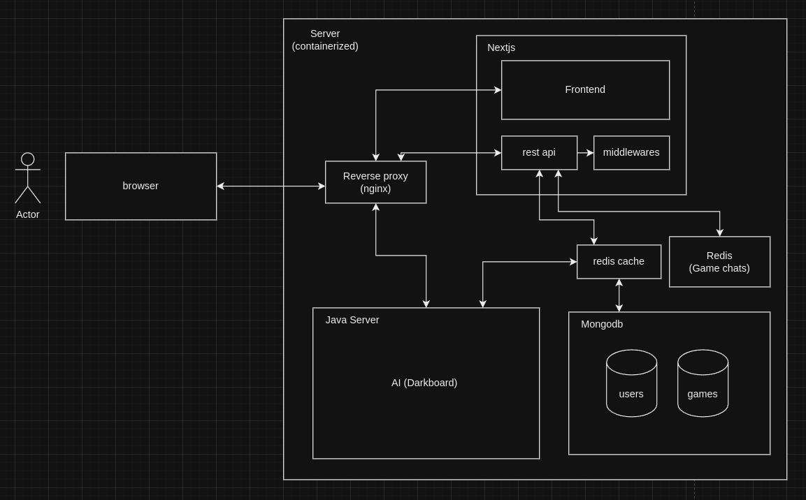
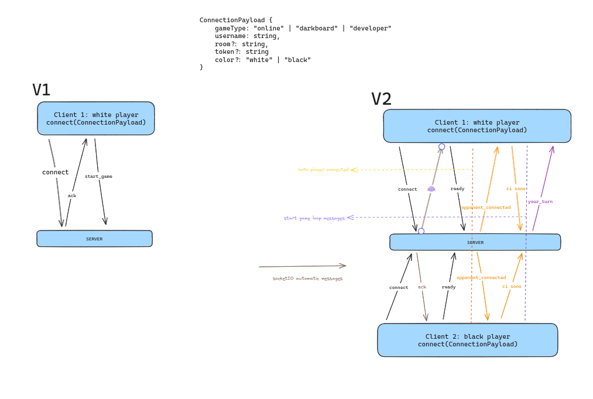

# Project Architecture

## Introduction

We have decided to build a web application, based on **Docker containers**. This choice was made because it allows us to easily deploy the system on a server, and to have a consistent and reproducible environment.

The following technologies are used:

- [Docker](https://www.docker.com/), to build and run the containers;
- [Nginx](https://www.nginx.com/), to act as a reverse proxy and a load balancer;
- [Nextjs](https://nextjs.org/), to build the frontend and the backend of the web application;
- [Mongodb](https://www.mongodb.com/), to store the data;
- Various docker containers, one for each type of AI used for the various types of chess games (see [AI](#ai));

## Nginx

We will use **Nginx** to act as a reverse proxy and a load balancer. It will be used to redirect the requests to the correct container, based on the path of the request.

> **Example:** if the request is for `/api`, it will be redirected to the container that runs the backend of the web application, while if the request is for `/kriegspiel/:id`, it will be redirected to the container that runs the backend of the **Kriegspiel** game.

## Nextjs

We will use **Nextjs** to build the frontend and the backend of the web application. It will be used to serve the frontend, and to provide the API for the frontend to communicate with the backend. 

## Mongodb

We will use **Mongodb** to store the data. It will be used to store the data of the users, the games, the leaderboard, and so on.

## AI

Given that we will have different types of chess games, we will surely need different types of AI, written in different languages. We know for sure that the AI for the **Kriegspiel** game is written in **Java**, while another AI could be written in **Python** or **C++**.

Each one of these containers will be able to communicate with the database and the other containers, in order to get the data needed to play the game.

> **Note:** this solution may not be the definitive one, and it may change in the future.

## Darkboard protocol

An online game, whether it being chess or any other game, needs to be robust and secure. In order to achieve this, our team has come up with a protocol that will be used to communicate between the client and the server for online games. This protocol is called **Darkboard protocol**.

Here is the basic schema of the protocol (V2 here), in comparison to the old way of communication.

A more robust protocol and a **server-side communication state management** made our product more secure and less prone to disconnection errors.