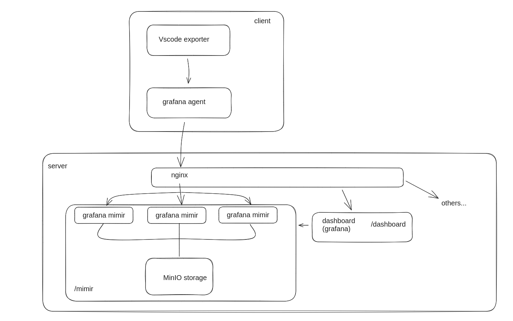
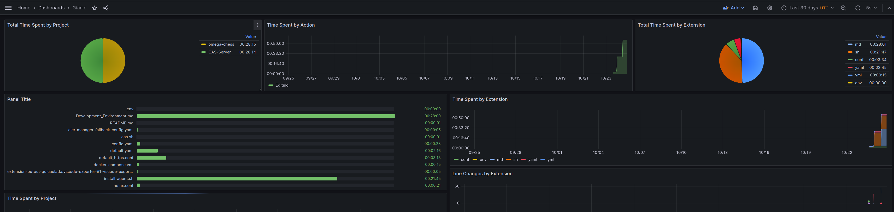

# Development Environment

This document describes how we set up our development environment.

> **Note:** This document is a work in progress.

> **Note:** This document describes the system as a whole. Not every part of the system is currently used ,e.g. sonarqube and jenkins are not yet configured; see ([TODO](#todo)).

We used [CAS](https://github.com/elPeroN/CAS-Server) as a starting point, modified it to our needs and added some features.

The current version of the development environment is available on [Gitlab](https://bolobeach.theworkpc.com/gitlab/gianlourbano/cas-server).

The environment is hosted on a server, and is accessible at [https://bolobeach.theworkpc.com](https://bolobeach.theworkpc.com).

## Technologies used

All the technologies used are open source and free to use.

Currently, all of the system is based on Docker containers. This allows us to have a consistent and reproducible environment, and to easily deploy the system on a server.

The following technologies are used:

- [Docker](https://www.docker.com/), to build and run the containers;
- [Nginx](https://www.nginx.com/), to act as a reverse proxy and a load balancer ([see below](#mimir));

Many other self-hosted technologies are used, like:

- [Gitlab](https://bolobeach.theworkpc.com/gitlab), to host the code and to manage the CI/CD pipelines;
- [Taiga](https://bolobeach.theworkpc.com), to manage the project;
- [Mattermost](https://bolobeach.theworkpc.com/mattermost), to communicate;
- [Sonarqube](https://bolobeach.theworkpc.com/sonarqube), to analyze the code;
- [Jenkins](https://bolobeach.theworkpc.com/jenkins), to manage the CI/CD pipelines;

In addition to this, we have built a very useful logger system, which will we described in more detail in the [Logger](#logger) section. This system is based on:

- [Grafana](https://bolobeach.theworkpc.com/dashboard), to visualize any kind of dashboard;
- [Grafana Agent](https://grafana.com/docs/grafana-cloud/agent/), to collect metrics from our editors;
- [VSCode Exporter](https://github.com/guicaulada/vscode-exporter), to expose metrics from VSCode, ready to be collected by the Grafana Agent;
- [Grafana Mimir](https://grafana.com/oss/mimir/), to process the metrics collected by the Grafana Agents;
- [MinIO](https://min.io/), to store the metrics processed by Grafana Mimir;

> **Note:** other technologies may be used in the future, and this document will be updated accordingly.

## How to use the development environment

Refer to the [README](https://bolobeach.theworkpc.com/gitlab/gianlourbano/cas-server/-/blob/main/README.md?ref_type=heads) of the project for instructions on how to use the development environment.

## Logger

We had the need to replace the old logger system present in **CAS**, because currently an extension for VSCode, our main editor, is not available. Writing one was not an option, as it would have taken too much time.

We decided to use an already existing extension, courtesy of [guicaulada](https://github.com/guicaulada), called [VSCode Exporter](https://github.com/guicaulada/vscode-exporter), which exposes many useful metrics from the editor in a **Prometheus** format.

**Grafana Agent** is used to collect the metrics from the editors, and send them over to the server. A [script](./scripts/install-agent.sh) is used to automatically set up and configure the agent on the machines used by the developers.

### Mimir

On the server side, we have **Nginx** that acts as a load balancer for our instances of **Grafana Mimir**, a timeseries database compatible with **Prometheus**. **Grafana Mimir** is used to store the metrics collected by the agents.

Finally, we have **Grafana**, which is used to visualize the metrics stored in **Grafana Mimir**.

Currently, the logger system looks like this:

### Grafana

**Grafana** is used to visualize the metrics collected by the agents. It is accessible at [https://bolobeach.theworkpc.com/dashboard](https://bolobeach.theworkpc.com/dashboard).

From the data collected by the agents, it is possible to create dashboards like this:

# TODO

In later stages of the project, we will setup the following technologies:
- **Sonarqube**
- **Jenkins**

Many integrations between the already existing technologies will be done, like:
- **Gitlab** CI/CD pipelines will be configured to run **Sonarqube** and **Jenkins**;
- **Mattermost** integrations will be configured to send notifications from **Gitlab** and **Jenkins**;
- **Taiga** integrations will be configured to be able to manage the project from **Gitlab**;
